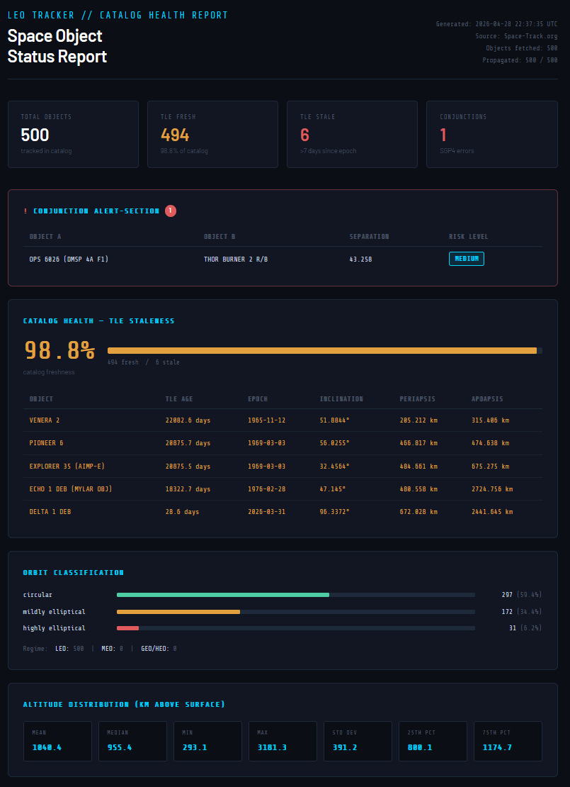

# LEO Tracker

A Python-based operational tool for monitoring the health of the Low Earth Orbit (LEO)
satellite catalog. Fetches live Tow-Line Element (TLE) data from the US Space
Surveillance Network, propagates orbital states using SGP4, performs catalog health
analysis, and generates an HTML operational report.

Built as a portfolio project to develop skills relevant to space operations and
astrodynamics engineering roles.



---

## What it does

1. **Fetches** live TLE data for LEO objects from the Space-Track.org REST API.
2. **Propagates** orbital states to the current time using the SGP4 model, computing
   ECI position and velocity vectors for each object.
3. **Analyzes** catalog health across three dimensions:
   - TLE Staleness - flags objects whose orbital elements are outdated (>7 days).
   - Orbit classification - categorizes objects by shape (circular, elliptical) and
   regime (LEO, MEO, GEO).
   - Conjunction screening - identifies object pairs whose separation falls below a
   configurable threshold.
4. **Reports** findings as a self-contained HTML document rendered via Jinja2 templates,
   designed for a satellite operator audience.

---

## Architecture
```
leo-tracker/
|- src/
|	|- fetcher.py		# Space-Track API authentication and TLE ingestion.
|	|- propagator.py		# SGP4 orbit propagation and Earth-centered inertial (ECI) state vector 
|	|- analyzer.py		# TLE age analysis, orbit classification, conjunction
|	|- reporter.py		# Report data assembly and Jinja2 HTML rendering
|
|- templates/
|	|- report.html		# Jinja2 HTML template for the operational report
|
|- scripts/
|	|- setup_env.sh		# Environment setup: venv creation, dependency install, .env loading
|	|- run_pipeline.sh	# End-to-end pipeline runner (cross-platform)
| - data/			# Local data cache (git-ignored)
| - reports/			# Generated HTML reports (git-ignored)
| - docs/			# Project documentation and assets
| - main.py			# CLI entry point with argparse
| - config.py			# Environment variable loading via python-dotenv
```

Each `src/` module has a single responsibility. `fetcher.py` fetches, `propagator.py`
propagates, `analyzer.py` analyzes, `reporter.py` reports. Data flows between them as
Pandas DataFrames.

---

## Tech Stack

Language: Python 3.11
Data pipeline: Pandas, NumPy
Orbit propagation: python-sgp4 (SGP4/SDP4 model)
API integration: Requests (authenticated REST session)
Templating: Jinja2
Environment management: python-dotenv, venv
Automation: Bash (setup and pipeline scripts)
Verion Control: Git

---

## Setup

### Prerequisites

- Python 3.11+
- A free [Space-Track.org](https://www.space-track.org/auth/createAccount) account
- Bash (Linux, macOS, or WSL on Windows)

### Installation

```bash
# Clone the repository
git clone https://github.com/JLopez-Astro/leo-tracker.git
cd leo-tracker

# Copy the environment template and fill in your Space-Track credentials
cp .env.example .env
nano .env

# Run the setup script - create the virtual environment and installs dependencies
source scripts/setup_env.sh
```

### `.env` file
```
 SPACETRACK_USERNAME=your_email@example.com
 SPACETRACK_PASSWORD=your_password
 FETCH_LIMIT=100
```

### CLI flags
`--format`	Output format (`html`), Default: `html`
`--limit`	Number of objects to fetch, Default: Value in `.env` 
`--no-report`	Skip report file generation, Default: Off


## Limitations & Future Work

- **Conjunction screening is instantaneous** - it checks separation at a single
propagation time, not across a future time window. A proper screener would propagate all
objects forward and find the time of closest approach (TCS) for each pair.
- **SGP4 accuracy degrades with TLE age** - objects with epochs older than a few days
have increasing positional uncertainty, especially at lower altitudes where drag is stronger.
- **Output formats** - CSV and plain text renderers are planned. The reporter
architecture already supports this: adding a new format requires only a new `render_*()`
function and template.
- **Kalman filter integration** - incorporating measurement updates would allow proper
statistical orbit determination rather than open-loop propagation.

---

## Data Source

TLE data is provided by the [US Space Surveillance Network](https://www.space-track.org)
via the Space-Track.org REST API. A free account is required. Data is subject to Space-
Track's [terms of service](https://www.space-track.org/documentation#/user-agreement).

---

## Author

**John Lopez** — [LinkedIn](https://www.linkedin.com/in/johnslopez97/) | [GitHub]
(https://github.com/JLopez-Astro)
